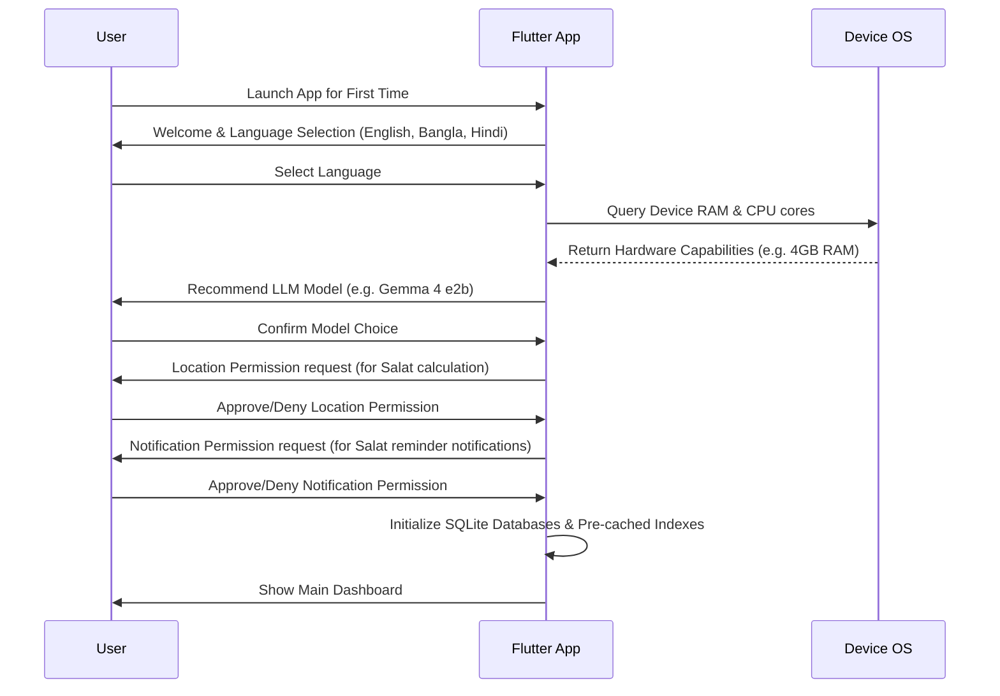

# Application Flow (AppFlow) - Learn Quran Offline Mobile App

## 1. Onboarding Flow
The onboarding flow is designed to set up the local environment, detect hardware capabilities, and configure the user's initial learning preferences without requiring an internet connection.

---

## 2. Navigation Shell
The app uses a persistent bottom navigation bar containing 4 main destinations:

1.  **Dashboard (Home)**
2.  **Quran Reader**
3.  **Q&A Agent (Gentle Teacher)**
4.  **Settings**

---

## 3. Detailed Screen Flows

### 3.1. Dashboard (Home) Screen
*   **Default View:**
    *   *Top Section:* Islamic Date, Current Location, and Next Prayer Time countdown.
    *   *Interactive Prayer Panel:* Lists all 5 daily prayers (Fajr, Dhuhr, Asr, Maghrib, Isha) with checkmarks indicating if completed (local self-reporting log) and a toggle for alarms.
    *   *Daily Reflection:* A card containing a "Daily Curated Story" compiled locally based on the user's progress. Tapping opens the full Story View.
    *   *Quick Search:* A search bar linked directly to the Q&A Agent.
*   **Interactions:**
    *   Tapping a prayer opens a detailed prayer times settings sheet.
    *   Tapping the Daily Reflection opens a detailed reflection modal.

### 3.2. Quran Reader Screen
*   **Default View:**
    *   Two tabs: **Surah List** (114 Surahs, searchable) and **Juz List** (30 Juz parts).
*   **Reader view:**
    *   Tapping a Surah enters the scrolling Reader.
    *   Each Ayah card contains:
        *   Arabic text (highly readable Uthmani script).
        *   Word-by-word breakdown toggle. Tapping a single Arabic word shows a small popover with its root word, grammar category, and meaning.
        *   Selected translation text (English/Bangla/Hindi).
        *   Ayah Action Menu: Bookmark, Share, Play Audio, View Tafsir.
    *   *Bottom Audio Bar:* Appears when playing recitation. Controls for Play/Pause, repeat verse $N$ times, and speed.
    *   *Tafsir Panel:* Sliding bottom sheet displaying scholarly commentary for the selected Ayah.

### 3.3. Q&A Agent Screen
*   **Default View:**
    *   Greeting from the "Gentle Teacher" agent.
    *   Suggested prompts grid (e.g. *"What does the Quran say about kindness to parents?"*, *"How did the Prophet deal with stress?"*).
    *   Scrollable list of past saved conversations.
*   **Chat View:**
    *   Streaming text interface showing messages.
    *   *Agent Response Card:* Includes:
        *   Calm, gentle response text.
        *   **Sources Cited section** (interactive list of verse/Hadith links). Tapping a verse link opens a popover displaying the verse text.
    *   *Context Options:* "Save Conversation" or "Wipe History".

### 3.4. Settings Screen
*   **Sections:**
    *   **Translation & Audio:** Select default translations and recitation voices.
    *   **Inference Settings:** Model selector (Gemma 4 e2b vs Gemma 4 e4b), token generation speed/metrics display toggle.
    *   **Salat Settings:** GPS toggles, manual coordinates entry, calculation methods (e.g. ISNA, MWL, Umm al-Qura).
    *   **Privacy & Data:** Exports user logs (JSON), wipes all local data.
