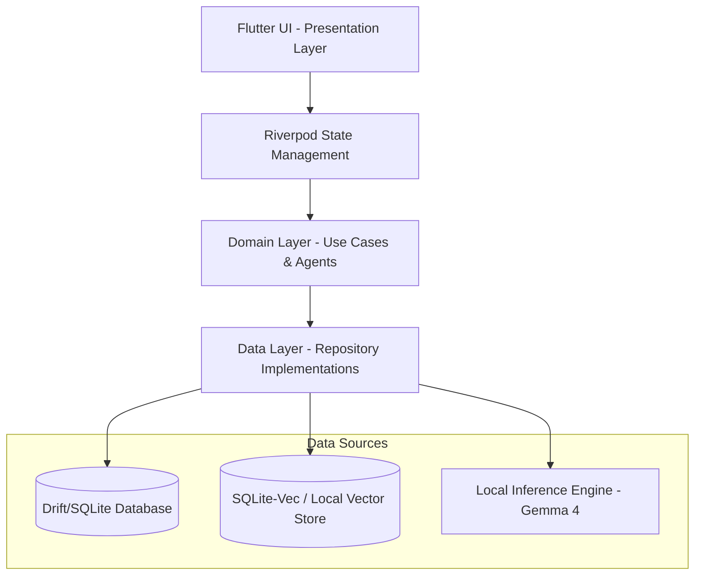

# Technical Specification (TechSpec) - Learn Quran Offline Mobile App

## 1. System Architecture Overview
The app is designed as a fully client-side, offline-first mobile application built using **Flutter**. It follows **Clean Architecture** principles to separate the presentation, domain, and data layers, ensuring modularity, testability, and maintainability.



---

## 2. Technology Stack & Core Packages

| Component | Technology | Description |
|---|---|---|
| **Framework** | **Flutter (Dart)** | Cross-platform UI development for iOS and Android. |
| **State Management** | **Riverpod** | Compile-safe dependency injection and state management. |
| **Local Database** | **Drift** (SQLite) | Reactive, type-safe persistence for user progress, settings, and metadata. |
| **Vector Database** | **sqlite-vec** (SQLite extension) | Lightweight, C-based vector similarity search compiled directly into SQLite. |
| **Local LLM Inference** | **llama.cpp** / **onnxruntime_flutter** | For running Gemma 4 e2b (2-billion params) & Gemma 4 e4b (4-billion params) on-device. |
| **Local Embeddings** | **ONNX Runtime Mobile** | Running a compact multilingual embedding model (e.g., `sentence-transformers/LaBSE` or a pruned `minilm`) for RAG indexing. |
| **Prayer Calculations** | **Adhan Dart** | Lightweight library to compute Salat times based on latitude, longitude, and calculation method. |
| **Notifications** | **flutter_local_notifications** | Schedules offline notifications/reminders for prayer times. |
| **Background Jobs** | **Workmanager** | Runs periodic background tasks (e.g. scheduling Salat alarms, daily story caching). |

---

## 3. Data & Storage Strategy

### 3.1. Knowledge Base (Pre-packaged)
*   **Static Corpus:** The app includes a read-only SQLite database containing the Quran (Arabic text + English/Bangla/Hindi translations), Sahih Hadiths, Tafsir text, and selected reference materials.
*   **Vector Index:** A pre-computed vector index database (`sqlite-vec` format) is shipped within the app assets. This avoids requiring the user's device to run intensive embedding generation for the default corpus.
*   **Incremental User Embeddings:** If users bookmark/notes are added, a light on-device embedding model updates the user's custom index.

### 3.2. User Progress & Logs (Writeable)
*   Managed via **Drift** using SQLite.
*   Includes: Reading progress tracker, Salat reminder preferences, past conversation themes (anonymized & local-only), and Salat performance history.

---

## 4. Local AI & RAG Engine

### 4.1. LLM Execution Model
*   **Device Profiles:**
    *   *Low-End (RAM < 6GB):* Defaults to **Gemma 4 e2b** (quantized to 4-bit, ~1.3GB model file).
    *   *High-End (RAM >= 6GB):* Defaults to **Gemma 4 e4b** (quantized to 4-bit, ~2.6GB model file).
    *   *Manual Selector:* Accessible in Settings.
*   **Inference Engine:** A native C++ binding library compiled with Flutter (via FFI) using `llama.cpp` to take advantage of GPU acceleration (Metal on iOS, Vulkan/NNAPI on Android).

### 4.2. RAG Pipeline Flow
1.  **User Question:** User types a query.
2.  **Embedding Generation:** Query is converted into a vector using a lightweight local embedding model via ONNX.
3.  **Similarity Search:** `sqlite-vec` queries the pre-packaged vector database for the top $k$ relevant segments (Quran verses, Hadiths, Tafsirs).
4.  **Prompt Formulation:** System prompt wraps the user query with retrieve segments:
    ```
    [System Instruction: Act as a calm, gentle Islamic teacher. Answer only using the context below. Cite verses/Hadiths. If the answer cannot be found in the context, say so respectfully.]
    [Context Segments]
    [User Query]
    ```
5.  **Local Generation:** Gemma 4 processes the prompt and streams the response to the UI.

---

## 5. Security & Privacy Specs
*   **Data Sandbox:** All databases and LLM files are stored in the application's secure documents directory (`NSDocumentDirectory` on iOS, App Internal Storage on Android).
*   **Zero Network Requests:** No telemetry, API keys, or cloud requests are permitted within the core AI engine.
*   **Salat Calculation Privacy:** Location coordinates are used only locally via GPS to calculate prayer times and are never sent to external servers.

---

## 6. AI-Assisted Development & Skill Configurations
The project will be managed using the following skill bundles from `antigravity-awesome-skills`:
1.  **Essentials:** Standardized TDD workflow and unified planning.
2.  **Agent Architect & LLM Application Developer:** Setup of local FFI bindings and prompt templates.
3.  **Data Engineering:** Schema definitions for Drift and SQLite-Vec.
4.  **Mobile Developer:** Flutter widgets, responsive layouts, and cross-platform native plugins.
5.  **Security Developer:** Ensuring absolute sandbox isolation and cryptographic security for local logs.
